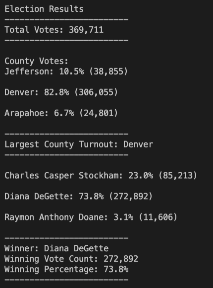

# Election_analysis

## Project Overview
A Colorado Board of Elections employee has asked us to audit a recent local congressional election. In order to complete the audit, we performed five tasks
1. Calculate the total number of votes cast.
2. Get a complete list of candidates who received votes.
3. Calculate the total number of votes each candidate received.
4. Calculate the percentage of votes each candidate won.
5. Determine the winner of the election based on popular vote.

## Resources
- Data Source: election_results.csv
- Software: Python 3.6.1, Visual Studio Code, 1.38.1

## Election-Audit Results
There were 369,711 total votes cast in the election. Votes were cast from 3 counties
1. Jefferson cast 38,855 votes, which was 10.5% of total votes.
2. Denver cast 306,055 votes, which was 82.8% of total votes.
3. Arapahoe cast 24,801 votes, which was 6.7% of total votes.
The county with the largest number of votes was Denver.

There were three congressional candidates in the election.
1. Charles Casper Stockham
2. Diana DeGette
3. Raymon Anthony Doane

The candidate results were
- Charles Casper Stockham received 23.0% of the vote and (85,213) total votes.
- Diana DeGette: 73.8% received of the vote and (272,892) total votes.
- Raymon Anthony Doane received 3.1% of the vote and (11,606) total votes.

The winner of the election was
- Diana DeGette who received 73.8% of the vote and 272,892 total votes.

## Election-Audit Summary
The election department can use this script for future elections. The script will provide the user with the number of votes per candidate and the number of votes per county, but the department will need to use the same file type. If the election department opts to change the data file, then the script will need to be edited to capture the row with the candidate name and the row with the county name. This script can also be modified to review the candidate popularity within a particular county (number of votes and vote percentage).
